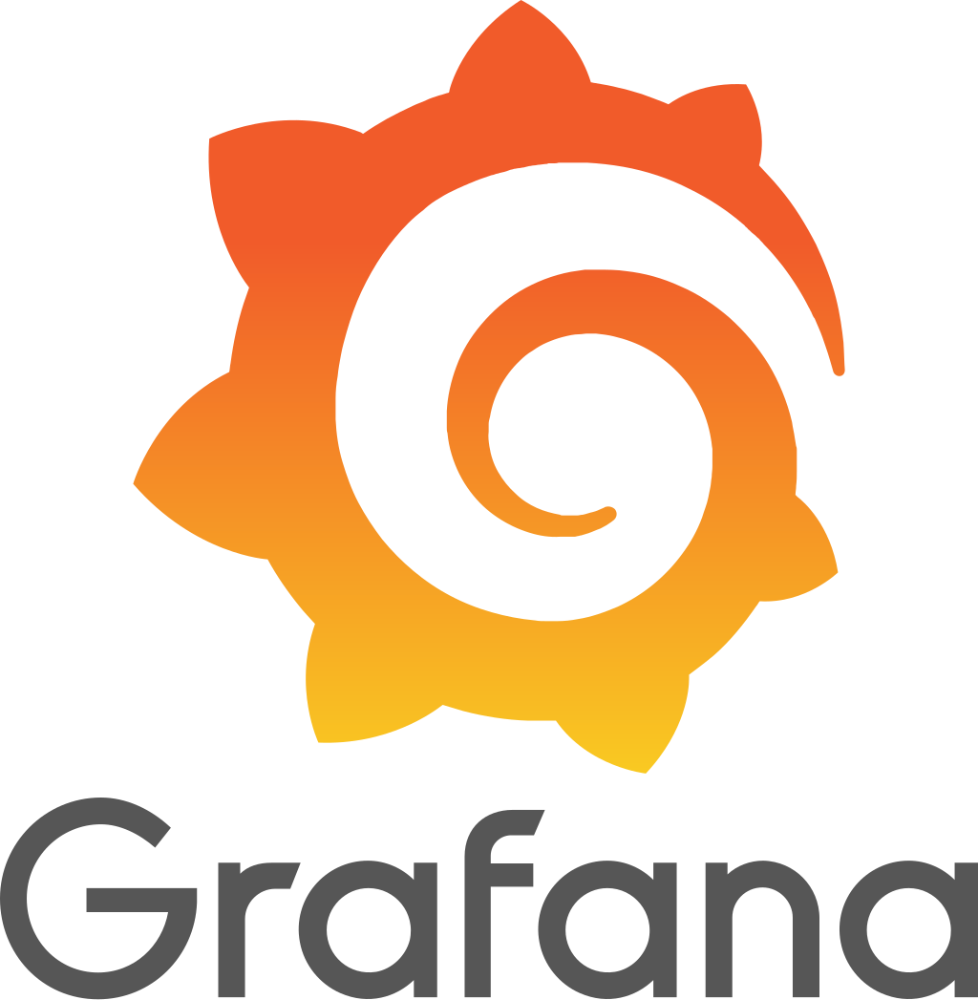

    
    
    

# Observability for Containerized Apps with cAdvisor, Prometheus & Grafana

In this course, you will learn the fundamentals of cAdvisor, Prometheus and Grafana.

## Intended Learning Outcomes (ILOs)

By the end of this tutorial, you will be able to:

- **Explain the role** of each component (cAdvisor, Prometheus, Grafana) within a container observability stack.

- **Deploy and integrate** cAdvisor, Prometheus, and Grafana to monitor a containerized application.

- **Collect and interpret** container-level resource metrics (CPU, memory, network, disk I/O) using cAdvisor and Prometheus.

- **Create and customize** Grafana dashboards to visualize these collected metrics effectively.

- **Analyze performance changes** within a containerized application under simulated load and identify potential bottlenecks.

## Motivation: Why Container Observability Matters for DevOps

In modern software development, applications are often deployed in containers, providing consistency and scalability. However, managing and troubleshooting these dynamic environments requires deep visibility into what's happening inside each container. Without effective observability, you're left guessing when performance issues arise, which can lead to extended downtime and operational inefficiencies.

This tutorial provides a practical solution by combining three essential open-source tools:

- **Prometheus:** An industry-standard for collecting and storing time-series metrics.

- **cAdvisor:** A specialized tool that extracts detailed resource usage and performance metrics directly from running containers, offering a granular view that Prometheus alone doesn't provide.

- **Grafana:** A powerful platform for creating interactive and insightful dashboards, transforming raw metrics into easily understandable visualizations.

By learning to integrate these tools, you will gain the ability to:

- **Proactively monitor** the health and performance of your containerized applications.

- **Quickly diagnose** and resolve issues by having clear data about resource consumption.

- **Optimize resource allocation**, ensuring your applications run efficiently without over-provisioning.

- **Maintain high availability and reliability**, which are critical for any successful DevOps practice.

This stack empowers you to move beyond basic uptime checks and truly understand the operational dynamics of your containerized services.

## Executable Tutorial Overview

This hands-on tutorial is structured to guide you step-by-step through setting up and utilizing our observability stack:

1. **Setting Up the Application:** We will begin by deploying a sample Flask application in a Docker container, providing a concrete workload to monitor.

2. **Introducing cAdvisor:** You will learn how to install and configure cAdvisor to gather detailed resource metrics directly from your running containers.

3. **Configuring Prometheus:** We will then set up Prometheus to reliably scrape and store these valuable metrics exposed by cAdvisor.

4. **Visualizing with Grafana:** Finally, you will learn the basics of installing and configuring Grafana, connecting it to Prometheus, and creating informative dashboards to visualize your container metrics.
