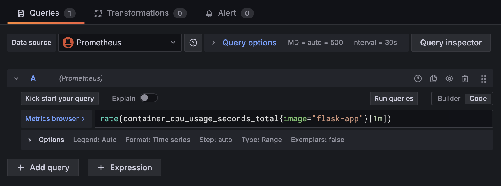

# Step 5: Visualizing Container Metrics with Grafana

With Prometheus collecting metrics from cAdvisor and Grafana set up to use Prometheus as a data source, we can now create dashboards to visualize our container performance. We'll create a panel to show CPU usage for our `flask-app` container.

## Navigate to Grafana & Sign In

1. Open your Grafana UI by clicking on the following link: **[http://localhost:3000]({{TRAFFIC_HOST1_3000}})**.

2. Sign in with your credentials:
   - **Username:** `admin`
   - **Password:** `admin`

## Create a New Dashboard and Panel

1. In the top-right corner of the Grafana interface, click the "+" **(Add)** icon.

2. Select **"New dashboard"**.

3. In the new, empty dashboard, click on **"Add visualization"**.

## Configure the Prometheus Data Source

1. You'll be prompted to select a data source. Choose **"Prometheus"**. (It should be the default, as you only have this one configured).

## Set Up the CPU Usage Panel

1. **(Optional)** On the right-hand side, under **"Panel options"**, set the title to `CPU Usage`.

2. In the new panel editor below, click the **"Code"** button next to the **"Run queries"** button. This switches to a text editor for your query.

3. Paste the following PromQL query into the query input field:

    ```bash
    rate(container_cpu_usage_seconds_total{image="flask-app"}[1m])
    ```

    **What this query does:**

    - `container_cpu_usage_seconds_total`: This metric (collected by **cAdvisor**) tracks the total CPU time in seconds that your container has consumed since it started.

    - `{image="flask-app"}`: This is a label selector. It filters the metrics to only include those associated with the Flask app.

    - `[1m]`: This is a range vector selector, specifying that we want to look at data over the last 1 minute.

    - `rate(... )`: This function calculates the per-second average rate of increase of the counter over the specified time window (`1m`). This effectively shows you the __current CPU utilization rate__ in seconds per second.

    

4. Press **"Run queries"** (or the play button). You should now see data appearing in the panel above.

5. **Adjust Time Window**: At the top of the page, you'll see time range options. Select an appropriate window, for example, **"Last 15 minutes"**, to ensure you can see the historical data and the potential spike when you activate the stress test.

6. Click **"Save dashboard"** in the top-right corner.

7. Then, click **"Back to dashboard"** to view your newly created panel.

---

You have now successfully created a Grafana panel to visualize your container's CPU usage! In the next steps, you will trigger the `/cpu-stress` endpoint on your Flask application and observe how the spike in CPU load is reflected on this dashboard in real-time.
